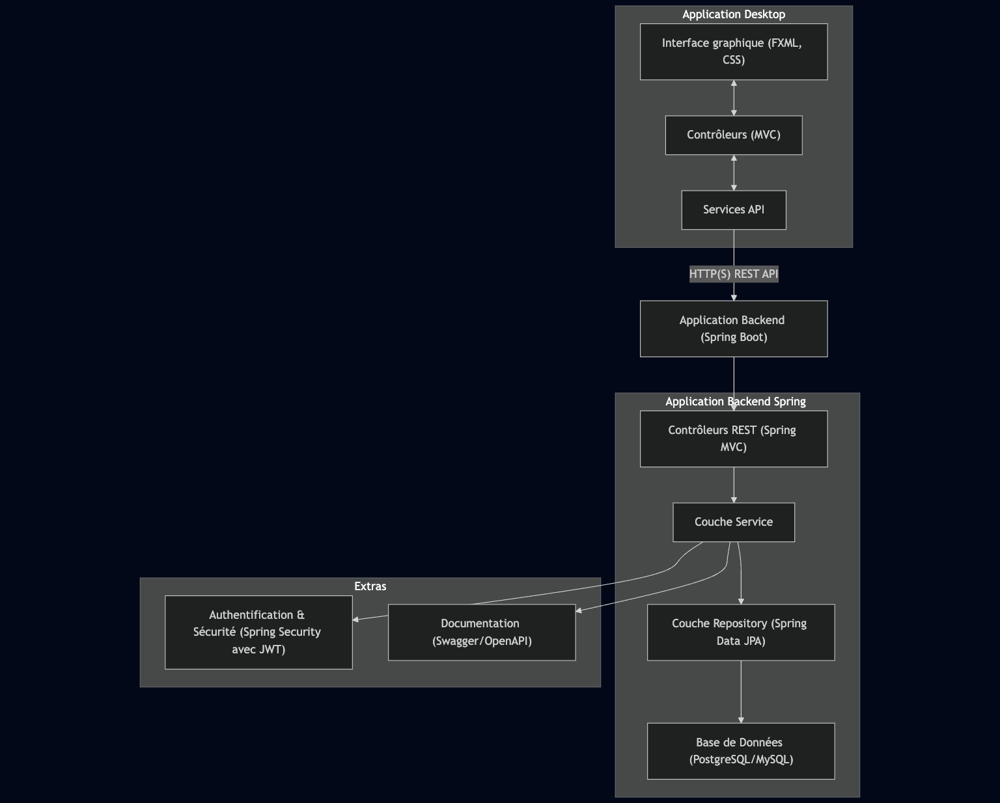

# 💼 Fluxo ERP

Fluxo ERP est une application de bureau moderne combinant JavaFX pour l'interface utilisateur et Spring Boot pour la
logique métier et la persistance des données. Elle est conçue pour répondre aux besoins des PME en matière de gestion
commerciale, offrant une solution complète et intuitive.


## 🚀 Fonctionnalités principales

- Gestion des produits
    - Ajout, modification, suppression et visualisation des produits
    - Suivi des stocks avec alertes sur les niveaux bas


- Gestion des fournisseurs et clients
    - Fiches détaillées avec coordonnées et historique des transactions


- Facturation et devis
    - Génération automatique de factures et devis au format PDF
    - Suivi des paiements et historique des facturations


- Rapports & Statistiques
    - Rapports sur les ventes, stocks, fournisseurs et clients
    - Tableau de bord interactif avec graphiques dynamiques


- Gestion des utilisateurs
    - Authentification et gestion des rôles (Admin, Employé, Comptable, etc.)


- Sauvegarde & Exportation
    - Exportation des données clés vers Excel et PDF

## Schéma architecture



## ⚙️ Installation et exécution

### Prérequis

- Java 21 installé sur votre machine
- Maven installé
- Télécharger/Dézipper les bons SDK et jmods à mettre dans le dossiers `/sdk` sur le [site](https://gluonhq.com/products/javafx/)
  - openjfx-17.0.14_osx-aarch64_bin-jmods.zip
  - openjfx-17.0.14_osx-aarch64_bin-sdk.zip
  - openjfx-17.0.15_windows-x64_bin-jmods.zip


### Étapes

#### Si vous utilisez Maven directement

1- Cloner le dépôt

```shell
git clone https://github.com/benaja-bendo/fluxo-erp.git
cd fluxo-erp
```

2- Construire le projet

```shell
mvn clean install
```

3- Exécuter l'application

```shell
mvn javafx:run
```

## 📁 Structure du projet

```shell
fluxo-erp/
├── HELP.md
├── LICENSE
├── README.md
├── assets
│   └── schema-architecture.png
├── docs
│   └── INSTALLER.md
├── installer
│   └── .gitkeep
├── mvnw
├── mvnw.cmd
├── pom.xml
├── scripts
│   └── build.sh
└── src
    ├── main
    │   ├── java
    │   │   └── com
    │   │       └── bgrfacile
    │   │           └── fluxo
    │   │               ├── FluxoApplication.java
    │   │               ├── config
    │   │               └── controller
    │   │                   └── MainController.java
    │   └── resources
    │       ├── META-INF
    │       │   └── MANIFEST.MF
    │       ├── application.yml
    │       ├── icon.icns
    │       ├── static
    │       └── templates
    │           └── main-view.fxml
    └── test
        ├── java
        │   └── com
        │       └── bgrfacile
        │           └── fluxo
        │               └── FluxoApplicationTests.java
        └── resources
```

## 🧩 Génération d'un installateur

Si vous souhaitez créer un installateur `.dmg`, `.exe`, ou `.deb` pour distribuer l'application, consultez le guide détaillé ici :

📦 [INSTALLER.md](docs/INSTALLER.md)

## Tags de release

- v0.1.0-alpha.1

## 📸 Captures d'écran
- Logo 

## 📄 Licence

Ce projet est sous licence MIT. Voir le fichier [LICENSE](LICENSE) pour plus d'informations.


